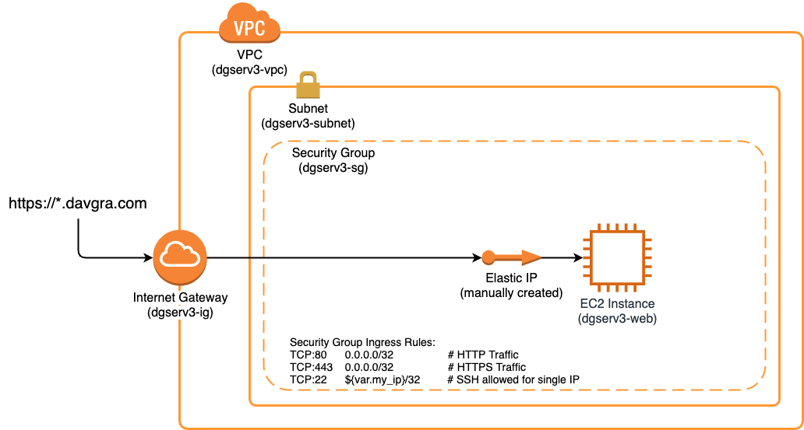
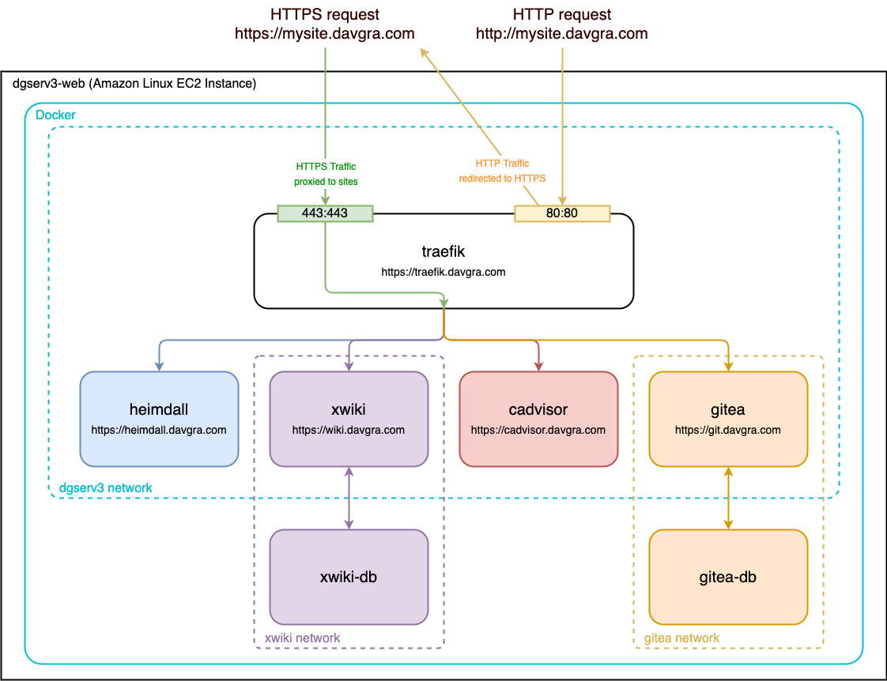

dgserv3
=======

dgserv3 is a Terraform project for managing personal websites in AWS. Sites are hosted as docker containers on an EC2 instance serving as the docker host.

Contents:
* [AWS Overview](#aws-overview)
* [Docker Overview](#docker-overview)
* [Create dgserv3 Infrastructure](#create-dgserv3-infrastructure)
* [Deploy dgserv3 Sites](#deploy-dgserv3-sites)
* [Notes](#notes)

## AWS Overview



## Docker Overview



## Create dgserv3 Infrastructure

### 1. Manually Create Elastic IP

Create an Elastic IP through the AWS UI

### 2. Set Up DNS Routing

Configure the domain provider's DNS settings with an A Record pointing to the Elastic IP.

### 3. Generate New Key

```bash
ssh-keygen -t rsa -C this-is-my-server-key -f ~/.ssh/whatever.key
```

### 4. Configure Terraform Vars

Put the following in a .tfvars file:

```bash
# deployment_20191031.tfvars
eip_allocation_id = "eipalloc-d3adb33fd3adb33f"     # elastic ip to associate instance with
my_ip = "8.8.8.8"                                   # IP to whitelist for SSH
dgserv_instance_type = "t2.medium"                  # server instance size

key_name = "this-is-my-server-key"                  # key name
private_key_path = "~/.ssh/whatever.key"            # private key path
public_key_path = "~/.ssh/whatever.key.pub"         # public key path
```

### 5. Terraform Apply

```bash
# Set the terraform workspace for the current deployment
cd tf/
terraform workspace select my-deployment

# init and launch using .tfvars file
terraform init
terraform apply -var-file="deployment_20191031.tfvars" --auto-approve
```

## Deploy dgserv3 Sites

### 0. Tunnel Docker Socket (optional)

This section is written assuming that the docker socket has been tunneled to the instance. Alternatively, copy or mount the dgserv3 dir to the instance, ssh over, and work from there.

See Notes below for Docker socket tunneling info.

### 1. Configure Deployment Vars

Create a .env file for storing email, domain, server IP, EC2 instance user, and EC2 instance key.

```bash
# dgserv-mysite.com-vars.env
EMAIL=whatever@email.com
DOMAIN=mysite.com
DGSERV_IP=8.8.8.8       # This is the Elastic IP for the deployment
DGSERV_USER=centos
DGSERV_KEY=~/.ssh/whatever.key

# User list for basic auth, To generate use:
#     echo $(htpasswd -nB user)
DGSERV_BASICAUTH_USER=user:$apr1$Jbi8Zf8m$lsyPAMst.lZ52FtkuH.f71
```

### 1. Deploy Traefik container

Traefik will act as our reverse proxy to any other deployed containers.

```bash
cd ..
docker-compose --env-file=dgserv-mysite.com-vars.env -f docker-compose.traefik.yaml up -d
```

### 2. Build Target Docker Image (if necessary)

```bash
cd deployments/heyo_world/
docker build -t heyo-world .
```

### 3. Deploy Target Container

```bash
docker-compose --env-file=../../dgserv-mysite.com-vars.env -f docker-compose.heyo_world.yaml up -d
```

## Notes

### Remotely Control Docker Host from Local Machine with Docker Socket Tunneling

```bash
# free socket if previously linked
unlink /tmp/socket.remote

# tunnels /tmp/socket.remote (local) to /var/run/docker.sock (on remote machine)
ssh -i ~/.ssh/whatever.key -nNT -L /tmp/socket.remote:/var/run/docker.sock centos@8.8.8.8 &
export TUNNEL_PID=$!
export DOCKER_HOST=unix:///tmp/socket.remote

# use docker, docker-compose, whatever
docker-compose...

# when finished, shutdown and cleanup of the socket
kill $TUNNEL_PID
rm -f /tmp/socket.remote
```

